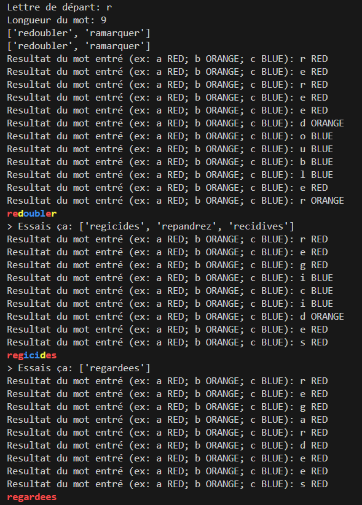

# WORDL_solver
A simple Wordl solver in French (TUSMO Game)

The game can be found here : https://www.tusmo.xyz/

/!\ This is only working in French language

The solver use a french words dictionnary to compute the most probable word to try on the game.

### How to use ?

execute MOTUS_solver.py

It will ask you for a first letter and a length. This should match what you have in the game.

Then the script will give you some words to try on the game.

Once tried, you will have to report the result into the script, letter by letter. RED colour correspond to a right letter at the right spot, ORANGE is an existing letter at the wrong spot and blue is not existing letter. 

By following these steps, you can find the right word !